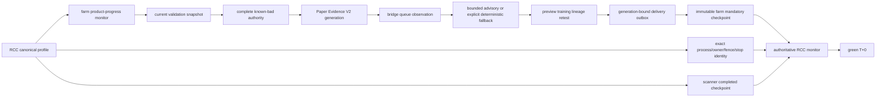

# Canonical Paper Startup Liveness Contract

Status: **CURRENT**

- Verified: 2026-08-22
- Verified against: `3c8499b2142b6884844b65c348d1c3571f74d68e`
- Scope: canonical paper-only startup from RCC launch through authoritative green
  T+0; no process authority is granted by this document.
- Evidence: `tests/test_product_progress.py`,
  `tests/test_farm_loop_stage_visibility.py`,
  `tests/test_paper_generation_cutover.py`, and the synthetic lifecycle suites.
- Residual risks: the implementation described as the task-branch candidate
  below has not been merged or operationally proven.
- Next gate: exact-head review, full non-live checks, merge, post-merge
  gate, then a separately owner-authorized runtime preflight and canary.

The current document is a dependency specification. Its repair proposal remains
**TASK-BRANCH CANDIDATE — NON-AUTHORITATIVE** until those gates complete.

This contract describes code dependencies, not a live workstation. It neither
changes a timeout nor treats a process, heartbeat, external `product_ready`
sample, historical debt, or a validation-publication event as T+0.

## Authoritative T+0 Path

`G` is the only authority that declares T+0. The farm checkpoint contains the
exact current V2 generation and successful delivery binding; it cannot be
manufactured from a live PID, an intermediate preview, or an externally
sampled boolean.

## Gate Classification

| Gate | Class | T+0 behavior |
|---|---|---|
| RCC process identity, single owner, fence, canonical stop intent | safety | Missing, stale, conflicting, or stopped is fail-closed. |
| Scanner completed checkpoint | mandatory current product | Required by RCC; public provider degradation remains classified, never fabricated as completion. |
| Current validation snapshot and exact generation | mandatory current product | `pending`, stale, corrupt, or mismatched authority cannot produce a farm checkpoint. |
| Complete known-bad authority | mandatory current product | Missing, corrupt, incomplete, or digest-mismatched evidence blocks V2 input. A cache is not a substitute. |
| V2 bridge, queue, observation, preview, training, lineage, retest, delivery | mandatory current product | Every consumer is exact-run bound; delivery ambiguity remains fail-closed. |
| Calculator advisory | mandatory bounded attempt | Accepted advice is bounded; timeout/rejection/exhaustion is explicitly deterministic fallback, not an authority change. |
| Historical validation debt | maintenance/backlog | Visible degradation and service-SLO evidence; it does not replace fresh current-product latency or block a completed current product. |
| System analyst, role dispatch/reconcile, calibration, quality | post-T+0, generation-bound | Consume the immutable delivered product. Their output cannot alter the delivered card or authorize it retroactively. |
| Setup-outcome memory backfill | post-T+0, resumable historical lane | Only a complete identity-bound snapshot may publish. Partial cache is acceleration only; owner/fence/stop/generation/corruption failures still fail closed in this lane. |
| Legacy `paper_runtime` and `true_forward` | post-T+0 research | Useful non-authoritative projections; excluded from Paper Evidence V2 authority. |
| Loop status, journals, storage-maintenance status | observational | Evidence only; they cannot establish current product truth. |

## Successor Publication and the Former Cycle

A priority validation worker may atomically publish a successor current
generation while an older foreground pass has already observed
`waiting_validation_generation`. Treating publication as ready would be unsafe:
the new manifest still needs complete known-bad-gated V2 processing and
delivery. Letting the old pass continue through historical/research work was
also unsafe for startup liveness because it could consume the bounded 600-second
window before the next 180-second farm cadence.

The merged PR #286 candidate preserved both facts for a publication already
visible to the foreground pass. The current task-branch repair closes the
remaining sleep/re-entry handoff gap:

1. the worker raises a sequence-preserving generation latch only after atomic
   current-generation publication;
2. a foreground pass that saw `waiting_validation_generation` returns without
   publishing a farm checkpoint;
3. waking from cadence records a typed current-generation re-entry request;
   it does not clear a concurrent second publication;
4. only its resulting generation-bound delivery can publish the mandatory
   farm checkpoint.

Thus there is no `publication → ready` shortcut and no
`awaiting checkpoint → generic intake/discovery/backlog work → startup timeout`
cycle. The re-entry runs bounded PFR materialization, exact current-generation
verification, Paper Evidence V2, preview and guarded delivery; it excludes
intake, discovery, coordinator, broad live-mover work, journals, storage and
post-T+0 maintenance.

## Canonical Post-Stop Integrity Targets

Post-stop integrity is a separate read-only gate after quiescence. A monitor
must resolve targets through
`src/research_lab/post_stop_integrity_targets.py`, not hard-code a guessed
SQLite location. The resolver accepts only the canonical private root, the
validated active Paper Evidence V2 manifest path
`state/derived/paper_evidence.sqlite3`, and the canonical candle-store path
`market_data/candles.sqlite3`. It intentionally does not open a database,
declare integrity, or establish runtime readiness; a missing target remains a
real later integrity result rather than an `unable_to_open` path bug.

## Synthetic Scenario Matrix

| Scenario | Expected result |
|---|---|
| No historical debt; current generation ready | Full mandatory chain can establish T+0 within the unchanged 600-second ceiling. |
| Historical debt; current generation ready | Same T+0 path; debt is observable degradation, not current readiness. |
| No debt; successor publication awaiting fresh farm pass | No false T+0; old pass yields, immediate current V2 pass is required. |
| Debt and awaiting successor | Same no-false-T+0 rule; debt does not disguise missing current output. |
| Stale/corrupt generation | Fail closed; bounded exact-current successor grace is the only allowed transition. |
| Stop intent, owner loss, or fence loss | Fail closed before publication/effect; no checkpoint is emitted. |
| Cold start or resume | Cache/backfill may be absent or partial only after the product boundary. Current authority still must be complete and exact-run bound. |

The matrix is covered by the focused product-progress, generation, ownership,
stop-intent, memory-resume, and farm-loop tests. It is synthetic proof only;
operational proof remains a separate canary.

## Explicit Non-Claims

The unchanged 600-second ceiling is an upper failure bound, not a performance
claim. A green test does not prove provider availability, Telegram delivery,
data completeness, profitability, live readiness, or a completed canary.
